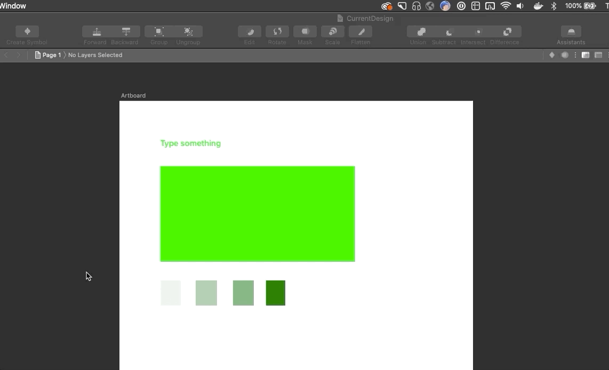

# Swap Color Libraries
Change all your colors in a document to point to a different library using the same color variable names.

## Installation

- [Download](../../releases/latest/download/swapcolorlibraries.sketchplugin.zip) the latest release of the plugin
- Un-zip
- Double-click on swapcolorlibraries.sketchplugin
